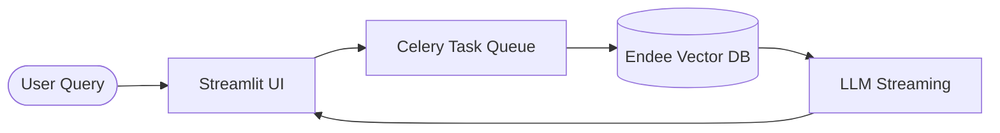

# 🧠 RepoMind: AI-Powered Repository Intelligence

**RepoMind** is a production-grade AI code assistant that enables real-time, context-aware understanding of large repositories using advanced retrieval, distributed processing, and streaming techniques.

Built on top of **Endee**, a high-performance open-source vector database, RepoMind empowers developers to ask complex natural language questions about any GitHub codebase and receive grounded, cited answers in real-time.

---

## 🔥 Key Engineering Highlights

- **Delta Indexing (Incremental Updates)**: Optimized ingestion using **MD5 hashing** and **Git-aware change detection**, reducing re-indexing time by **>90%**.
- **Distributed Background Processing**: Orchestrated multi-stage repository indexing (Clone -> Detect -> Chunk -> Embed) using **Celery** with **Redis** as a task queue, ensuring a responsive, non-blocking UI.
- **Real-Time LLM Streaming**: Engineered a high-fidelity chat experience with token-level streaming and a live typing indicator, reducing perceived latency for complex queries.
- **Scalable Architecture**: Designed a decoupled system using **LangChain**, **Endee Vector DB**, and **FastAPI** to handle deep codebase indexing at scale.

---

## 🏗️ System Architecture

RepoMind combines semantic search with modern distributed system principles:

1. **Ingestion**: Asynchronous workers clone repositories and detect changes via Git diff.
2. **Indexing**: Language-aware chunking and embedding generation stored in a persistent **Endee** vector store.
3. **Retrieval**: Semantic query expansion and retrieval of the most relevant source code snippets.
4. **Generation**: LLM-powered answer generation with direct citations to files and functions.
5. **Streaming**: Real-time token delivery to the Streamlit frontend.



---

## ⚡ Tech Stack

- **Backend**: Python 3.11+, LangChain, FastAPI
- **AI/LLM**: Groq (Llama 3.3 70B), OpenAI, Sentence-Transformers
- **Vector DB**: **Endee** (C++ optimized engine)
- **Task Management**: Celery + Redis
- **Frontend**: Streamlit

---

## 🚀 Quick Start

### 1. Start Infrastructure (Docker)
```bash
# Start Endee Vector DB
docker run -p 8080:8080 -v ./endee-data:/data endeeio/endee-server:latest

# Start Redis
docker run -p 6379:6379 redis:latest
```

### 2. Setup RepoMind
```bash
# Clone and install
git clone https://github.com/Archisman-NC/endee.git
cd endee
python3 -m venv venv && source venv/bin/activate
pip install -r requirements.txt

# Configure environment (add your API keys)
cp .env.example .env
```

### 3. Run the System
```bash
# Start the Celery Worker
PYTHONPATH=. celery -A repomind.celery_app worker --loglevel=info

# Launch the UI
streamlit run repomind/frontend/app.py
```

---

## 📚 Deep Dives
- [**RepoMind Technical Deep Dive**](./repomind/README.md) – Detailed architecture and engineering choices.
- [**Endee Vector DB Internal Docs**](./docs/getting-started.md) – Performance benchmarks and C++ engine details.

---

## 📜 License
Licensed under the Apache License 2.0.
