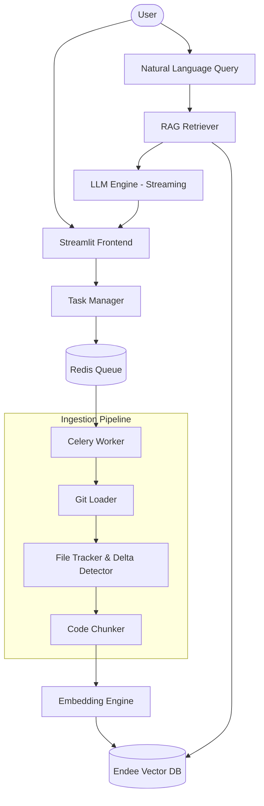

<p align="center">
  
</p>

<p align="center">
  <b>An AI-powered repository intelligence system for real-time, context-aware understanding of large codebases.</b>
</p>

<p align="center">
  
  
  
  
  
  
</p>

---

## 🚀 Project Overview

**RepoMind** is a production-grade AI code assistant that enables developers to interact with any GitHub repository through natural language. Unlike simple chat-with-code scripts, RepoMind is built with a scalable background indexing architecture, incremental synchronization, and real-time streaming responses.

Whether you are auditing a legacy codebase, onboarding to a complex project, or tracking architectural patterns across modules, RepoMind provides grounded, cited answers derived directly from the source.

---

## 🔥 Key Features

### 🧠 Semantic Code Intelligence
- **RAG-based Q&A**: Answers are grounded in the actual codebase, with direct citations to source files and line-specific context.
- **Language-Aware Indexing**: Sophisticated code splitting that respects syntax boundaries for Python and other major languages.

### ⚡ Performance & Scalability
- **Delta Indexing (Incremental)**: Uses Git-aware change detection and MD5 hashing to only re-index files that have changed. Reduces compute cost and indexing time by >90% on subsequent runs.
- **Distributed Background Workers**: Leverage **Celery + Redis** to handle repo cloning and embedding generation asynchronously. The UI remains 100% responsive while processing large repositories.
- **Real-Time Streaming**: Token-by-token LLM response streaming for a high-fidelity "ChatGPT-like" experience.

### 🛠️ Developer-First Design
- **Live Activity Logs**: Monitor background task progress with granular step tracking (Cloning -> Detection -> Chunking -> Embedding).
- **Persistent State**: Redis-backed task management ensures indexing state and progress are preserved across user sessions and system restarts.

---

## 🏗️ System Architecture

RepoMind follows a decoupled, event-driven architecture designed for reliability and speed:



---

## 🏛️ Engineering Highlights (Focus for Interviewers/Recruiters)

- **Optimized Data Pipeline**: Built a hybrid **MD5 + Git Diff** delta detection system to avoid redundant vector upserts and reduce embedding API costs.
- **Distributed Task Management**: Orchestrated long-running ingestion workflows using **Celery** with **Redis** as a results backend, enabling horizontal scaling of workers.
- **Stateful Streaming UX**: Implemented a custom LangChain `BaseCallbackHandler` to pipe tokens from asynchronous LLM streams directly into Streamlit `st.empty()` placeholders.
- **Deterministic ID Generation**: Engineered a `file_path::chunk_index` ID scheme to ensure idempotency and reliable vector cleanup during re-indexing.

---

## 🛠️ Tech Stack

- **Foundations**: Python 3.11+, LangChain
- **AI/LLM**: Groq (Llama 3.3 70B), OpenAI, Sentence-Transformers
- **Storage**: **Endee** (C++ high-performance Vector DB), Redis
- **Async Workers**: Celery
- **Frontend**: Streamlit (with custom CSS/HTML component injection)

---

## ⚙️ Installation & Setup

### Prerequisites
- Docker (for Endee and Redis)
- Python 3.11+
- Groq or OpenAI API Key

### 1. Start Infrastructure
Start the Endee Vector DB and Redis:
```bash
# Start Endee
docker run -p 8080:8080 -v ./endee-data:/data endeeio/endee-server:latest

# Start Redis
docker run -p 6379:6379 redis:latest
```

### 2. Environment Setup
```bash
# Create venv
python3 -m venv venv
source venv/bin/activate
pip install -r requirements.txt

# Configure .env
cp .env.example .env
# Edit .env with your GROQ_API_KEY / OPENAI_API_KEY
```

### 3. Launch Workers & App
Open two terminal windows:
```bash
# Terminal 1: Celery Worker
PYTHONPATH=. celery -A repomind.celery_app worker --loglevel=info

# Terminal 2: Streamlit App
streamlit run repomind/frontend/app.py
```

---

## 📊 Usage

1. **Index**: Paste a GitHub repository URL in the sidebar.
2. **Track**: Monitor the visual progress bar and activity logs as RepoMind processes the code.
3. **Chat**: Once indexing is complete, ask questions like:
    - *"How is the authentication flow implemented?"*
    - *"Explain the data model for the task queue."*
    - *"Which files are responsible for handling LLM streaming?"*

---

## 📜 License
This project is part of the **Endee** ecosystem and is licensed under the Apache License 2.0.
